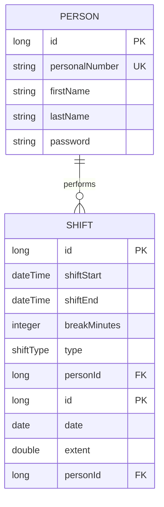

# SGI-Guard 🛡️

**SGI-Guard** is a backend service developed as part of my graduation project (degree project). The purpose is to help parents that mainly work irregular hours to protect their **SGI** (*Sjukpenninggrundande inkomst* / Sickness benefit qualifying income) by analyzing workshifts and validating desired parental leave. The service is made as a support of decisions and not as a 100 % decision service. And the rules that the service is based upon are interpreted by myself.

## About the Project
This project focuses on automating calculations for SGI protection according to the Swedish Social Insurance Agency's regulations. It warns users if their planned working hours risk negatively affecting their SGI. 

### Key Features
- **Shift Registration:** Add workhifts as baseline (original planned shift) or actual (an original shift but with reduced working hours).
- **SGI Analysis:** Calculate whether current work patterns meet the legal requirements for SGI protection and get recommendations for parental leave.
- **Parental Leave Registration:** Add parental leave a specific date that gets validated in consideration to weekend rules, long period of leave and desired extent.
- **REST API:** A backend built with Java Spring Boot, ready for frontend integration.
- **Thymeleaf:** A simple UI for presentational purposes.

## 🛠 Technologies
- **Java 21**
- **Spring Boot 3.x**
- **Spring Data JPA** (Persistence)
- **PostgreSQL** (Database for production)
- **H2** (Database for testing and development)
- **JJunit** for unit testing of services and repositories

## 🏗 Architecture & Data Model
The system uses a relational model centered around the person and their registered work shifts.



## Project Structure
Below is a simplified view of the project layout.

```
src/main/java/.../
  configs/
    DevSecurityConfig
    SecurityConfig
  controllers/
    LoginController
    ParentalLeaveController
    PersonController
    RegisterController
    SgiCalculationController
    ShiftController
    WebController
  dtos/
  entities/
    ParentalLeave
    Person
    Shift
  models/
  repositories/
  services/
    ParentalLeaveService
    PersonService
    SgiCalculationService
    SgiRuleService
    ShiftService
```

🏁 Getting Started

Prerequisites

* Java 21 SDK
* A running PostgreSQL postgres:16 instance (for production)
  


