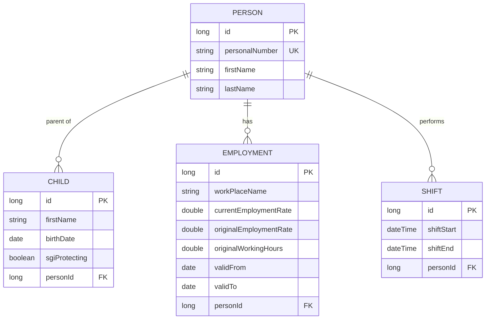

# SGI-Guard 🛡️

**SGI-Guard** is a backend service developed as part of my graduation project (degree project). The purpose is to help users protect their **SGI** (*Sjukpenninggrundande inkomst* / Sickness benefit qualifying income) by analyzing and validating work shifts and employment rates.

## 🚀 About the Project
This project focuses on automating calculations for SGI protection according to the Swedish Social Insurance Agency's regulations. It warns users if their worked hours or activity levels risk negatively affecting their benefit levels.

### Key Features
- **Shift Registration:** Log workshifts and employment intensity.
- **SGI Analysis:** Calculate whether current work patterns meet the legal requirements for SGI protection.
- **REST API:** A robust backend built with Spring Boot, ready for frontend integration.

## 🛠 Technologies
- **Java 21**
- **Spring Boot 3.x**
- **Spring Data JPA** (Persistence)
- **PostgreSQL** (Database)
- **H2** (Database for testing and development)
- **Lombok** (Boilerplate reduction)

## 🏗 Architecture & Data Model
To ensure SGI protection logic, the system uses a relational model centered around the person and their work-life balance.



## Project Structure
Below is a simplified view of the project layout.

```
src/main/java/.../
  controllers/
    ChildController
    EmploymentController
    PersonController
    ShiftController

  dtos/
    ShiftDTO

  entities/
    Child
    Employment
    Person
    Shift

  repositories/
    ChildRepository
    EmploymentRepository
    PersonRepository
    ShiftRepository

  services/
    ChildService
    ChildServiceInterface
    EmploymentService
    EmploymentServiceInterface
    PersonService
    PersonServiceInterface
    SgiCalculationService
    ShiftService
    ShiftServiceInterface

  utils/
    DateRange
```

🏁 Getting Started

Prerequisites

* Java 21 SDK
* A running PostgreSQL postgres:16 instance (for production)
  


