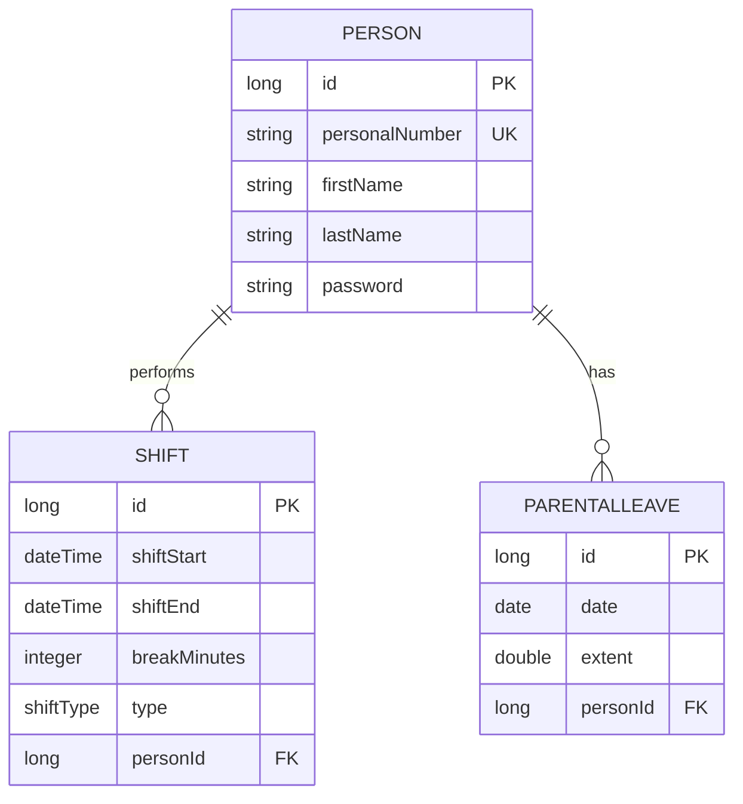

# SGI-Guard 🛡️

**SGI-Guard** is a backend service developed as part of my graduation project (degree project). The purpose is to help parents who mainly work irregular hours to protect their **SGI** (*Sjukpenninggrundande inkomst* / Sickness benefit qualifying income) by analyzing workshifts and validating desired parental leave. The service is intended as a decision support tool and not as a 100% decision-making system. The implemented rules are based on my interpretation of regulations from the Swedish Social Insurance Agency.
## About the Project
This project focuses on automating calculations for SGI protection according to the Swedish Social Insurance Agency's regulations. It warns users if their planned working hours risk negatively affecting their SGI. 

### Key Features
- **Shift Registration:** Register work shifts as baseline (original planned shift) or actual (an original shift but with reduced working hours).
- **SGI Analysis:** Calculate whether current work patterns meet the legal requirements for SGI protection and get recommendations for parental leave.
- **Parental Leave Registration:** Register parental leave for specific dates that gets validated in consideration to weekend rules, long period of leave and desired extent.
- **REST API:** A backend built with Java Spring Boot, ready for frontend integration.
- **Thymeleaf UI:** Server-side rendered user interface with forms, validation and weekly analysis visualization.

## 🛠 Technologies
- **Java 21**
- **Spring Boot 3.x**
- **Spring Security**
- **PostgreSQL** (Production profile with Docker support)
- **H2** (Database for testing and development)
- **JUnit 5** for unit testing

## 🏗 Architecture & Data Model
The system uses a relational model centered around the person and their registered work shifts.



## Project Structure
Below is a simplified view of the project layout.

```
src/main/java/.../
  configs/
    DevSecurityConfig
    SecurityConfig
  controllers/
    LoginController
    ParentalLeaveController
    PersonController
    RegisterController
    SgiCalculationController
    ShiftController
    WebController
  dtos/
  entities/
    ParentalLeave
    Person
    Shift
  models/
  repositories/
  services/
    ParentalLeaveService
    PersonService
    SgiCalculationService
    SgiRuleService
    ShiftService
```

## Getting Started

Prerequisites

* Java 21
* Maven

### Clone repository

```bash
git clone https://github.com/annlolil/sgiguard.git
cd sgiguard
```

### Start the application:

```bash
mvn spring-boot:run
```

Or run directly from your IDE.

Application will be available at:

http://localhost:8080/login

### Database

The application uses different database configurations depending on the active profile.
The application is per default set to development profile.

- **Development profile:** H2 in-memory database for fast testing and simplified setup.
- **Production profile:** PostgreSQL configured through Docker Compose for persistent storage.

The H2 database is created automatically at application startup and all stored data is removed when the application stops.
To open the H2 database:

1. Start the application and go to: http://localhost:8080/h2-console
2. Check that **JDBC URL** is: `jdbc:h2:mem:sgiguard`
3. Leave the field for password empty and click **Connect**.


